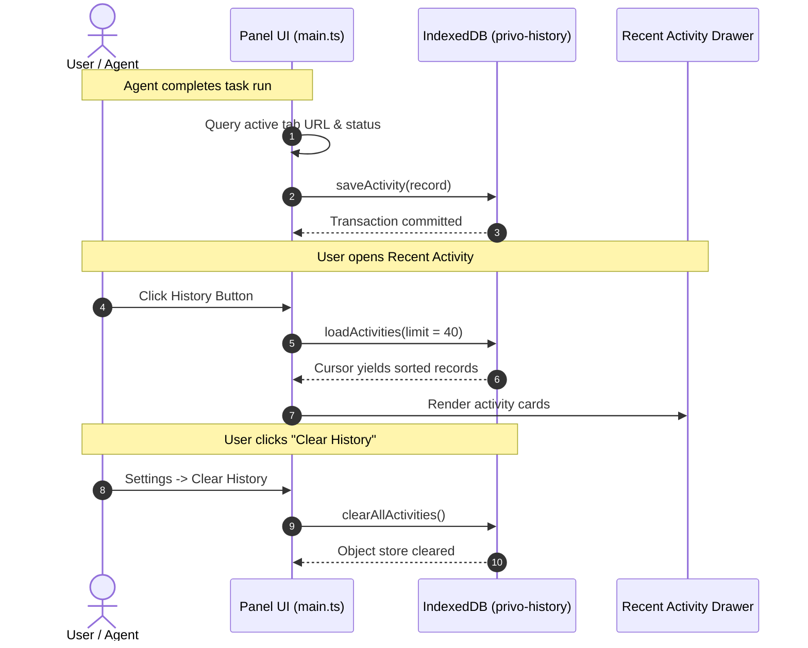

# Privo — Local Storage Architecture (IndexedDB)

> **Document Version:** 1.0  
> **Target Component:** `@privo/extension` (Side Panel & Agent History)  
> **Source File:** [`apps/extension/src/panel/main.ts`](file:///c:/Users/soumi/privo/apps/extension/src/panel/main.ts#L85-L163)  
> **Classification:** Technical Specification & Privacy Architecture  

---

## 1. Executive Overview

Privo operates under a strict **local-first, privacy-preserving model**:

$$\text{Local Observation} \longrightarrow \text{Local Detection} \longrightarrow \text{Local Sanitization} \longrightarrow \text{Sanitized Model Context}$$

In line with this principle, all operational activity history is stored **exclusively on the user's device** using the browser's native **IndexedDB** engine. No user prompts, visited URLs, activity timestamps, or execution traces are ever synchronized to external cloud databases.

---

## 2. Storage System Specifications

Privo utilizes IndexedDB for persistent tabular task history, while reserving `chrome.storage.local` for global preferences and temporary states.

| Parameter | Configuration |
|---|---|
| **Database Name** | `privo-history` |
| **Object Stores** | `activities` (task history), `credentials` (local credential vault) |
| **Primary Keys** | `activities.id` (Composite string), `credentials.domain` (Domain string) |
| **Indexes** | `activities.timestamp` (epoch ms), `credentials.updatedAt` (epoch ms) |
| **Schema Version** | `2` |
| **Storage Engine** | Native Browser IndexedDB (Isolated per extension origin) |

---

## 3. Data Schema & Model

### 3.1 TypeScript Interfaces

The schemas are defined in [`main.ts`](file:///c:/Users/soumi/privo/apps/extension/src/panel/main.ts#L109-L125):

```typescript
interface ActivityRecord {
    id: string                        // Unique identifier: `${Date.now()}-${randomSuffix}`
    taskText: string                  // User's task instruction
    url: string                       // Active tab URL when task was executed
    status: 'ok' | 'err' | 'stopped'  // Terminal state of execution
    stepCount: number                 // Total autonomous steps performed
    timestamp: number                 // Milliseconds since Unix epoch
}

interface CredentialRecord {
    domain: string                    // Normalized domain key e.g. "wikipedia.org"
    username: string                  // Username or email for the site
    password: string                  // Password stored strictly on local device
    updatedAt: number                 // Milliseconds since Unix epoch
}
```

### 3.2 Sample Record

```json
{
  "id": "1741635028192-k7x2p",
  "taskText": "Check balance for ACCOUNT_1",
  "url": "https://example-bank.com/dashboard",
  "status": "ok",
  "stepCount": 6,
  "timestamp": 1741635028192
}
```

---

## 4. Lifecycle & Database Operations



### 4.1 Database Initialization (`openHistoryDB`)
Opens the connection and idempotently creates the object store and indices during version upgrades:

```typescript
function openHistoryDB(): Promise<IDBDatabase> {
    return new Promise((resolve, reject) => {
        const req = indexedDB.open(DB_NAME, DB_VERSION)
        req.onupgradeneeded = () => {
            const db = req.result
            if (!db.objectStoreNames.contains(DB_STORE)) {
                const store = db.createObjectStore(DB_STORE, { keyPath: 'id' })
                store.createIndex('timestamp', 'timestamp')
            }
        }
        req.onsuccess = () => resolve(req.result)
        req.onerror = () => reject(req.error)
    })
}
```

### 4.2 Record Ingestion (`saveActivity`)
Invoked automatically in `showResult()` at the conclusion of every agent workflow:

```typescript
async function saveActivity(record: Omit<ActivityRecord, 'id'>) {
    try {
        const db = await openHistoryDB()
        const tx = db.transaction(DB_STORE, 'readwrite')
        const id = `${Date.now()}-${Math.random().toString(36).slice(2, 7)}`
        tx.objectStore(DB_STORE).put({ id, ...record })
        tx.oncomplete = () => db.close()
    } catch (e) {
        console.warn('[PRIVO] Failed to save activity', e)
    }
}
```

### 4.3 Querying History (`loadActivities`)
Uses a reverse cursor (`'prev'`) over the `timestamp` index to retrieve the most recent tasks first without loading the entire database into memory:

```typescript
async function loadActivities(limit = 40): Promise<ActivityRecord[]> {
    try {
        const db = await openHistoryDB()
        return new Promise((resolve, reject) => {
            const tx = db.transaction(DB_STORE, 'readonly')
            const index = tx.objectStore(DB_STORE).index('timestamp')
            const results: ActivityRecord[] = []
            const req = index.openCursor(null, 'prev')
            req.onsuccess = () => {
                const cursor = req.result
                if (cursor && results.length < limit) {
                    results.push(cursor.value as ActivityRecord)
                    cursor.continue()
                } else {
                    db.close()
                    resolve(results)
                }
            }
            req.onerror = () => { db.close(); reject(req.error) }
        })
    } catch {
        return []
    }
}
```

### 4.4 History Purge (`clearAllActivities`)
Allows the user to completely wipe all local history instantly:

```typescript
async function clearAllActivities() {
    try {
        const db = await openHistoryDB()
        const tx = db.transaction(DB_STORE, 'readwrite')
        tx.objectStore(DB_STORE).clear()
        tx.oncomplete = () => db.close()
    } catch (e) {
        console.warn('[PRIVO] Failed to clear history', e)
    }
}
```

---

## 5. Storage Engine Comparison in Privo

| Feature | IndexedDB (`privo-history`) | `chrome.storage.local` |
|---|---|---|
| **Primary Use** | Execution log, task history | User settings, capture gallery, IPC flags |
| **Capacity** | Multi-megabyte / gigabyte capable | Quota-managed (5MB–10MB default) |
| **Querying** | Indexed cursors (`timestamp` DESC) | Key-value dictionary only |
| **Data Format** | Complex structured objects | JSON-serializable primitives |
| **Origin Isolation** | Bound to extension origin (`chrome-extension://<id>`) | Bound to extension storage area |

---

## 6. Privacy Hardening Directives

To ensure the local database adheres strictly to zero-leakage security, the following safeguards must be enforced:

### 6.1 Sanitized Persistence (No Raw PII on Disk)
> [!IMPORTANT]
> Raw user prompts may inadvertently contain sensitive secrets (e.g., `"Search flight for John Doe passport A1234567"`).

* When saving to IndexedDB, `taskText` must be populated with **`sanitizedTask`** from `prepareModelContext()` rather than raw input.
* Sensitive URL query parameters must be stripped using `sanitizeUrl()`.

### 6.2 Data Retention & Pruning Limits
* **Maximum Age:** Records older than **30 days** should be automatically pruned during database initialization.
* **Maximum Capacity:** The object store should maintain a maximum of **100 records**, removing the oldest entries when exceeded.

### 6.3 Ephemeral Memory Registry
* The mapping between placeholders (`ACCOUNT_1`) and real values remains in **RAM only** via `PlaceholderRegistry`.
* Real credential values or secrets are **never** persisted to IndexedDB.
